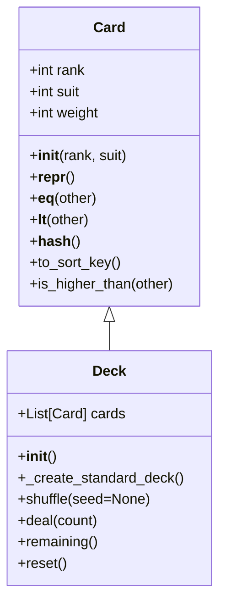

# Phase 1: Card 與 Deck 類別設計

## 1. 目標

定義 Big Two 的基礎資料模型，包含可比較的 `Card` 以及能建立、洗牌、發牌的 `Deck`。
本階段專注於遊戲基礎權重與資料結構，不包含玩家出牌邏輯。

## 2. Big Two 權重規則

- 數字權重：`3 < 4 < 5 < 6 < 7 < 8 < 9 < 10 < J < Q < K < A < 2`
- 花色權重：`♣ < ♦ < ♥ < ♠`
- 在同一張牌數字下，以花色作為次要比較依據。

## 3. 類別圖設計

## 4. 類別詳細

### 4.1 Card

屬性

- `rank: int`
  - 以 Big Two 規格定義：`3` 到 `14` 分別代表 `3` 到 `A`，`15` 代表 `2`。
- `suit: int`
  - 花色映射：`0=♣`, `1=♦`, `2=♥`, `3=♠`。
- `weight: int`
  - 組合權重計算值，通常為 `rank * 10 + suit` 或由 `to_sort_key()` 回傳。

方法

- `__init__(self, rank: int, suit: int)`
  - 驗證 `rank`、`suit` 範圍並儲存屬性。
- `__repr__(self) -> str`
  - 回傳人可讀格式，例如 `♠A`、`♦10`、`♣3`。
- `__eq__(self, other) -> bool`
  - 兩張牌的 `rank` 與 `suit` 均相等。
- `__lt__(self, other) -> bool`
  - 先比較 `rank`，若相等則比較 `suit`。
  - 透過 Big Two 特定順序：`2` 視為最大。
- `__hash__(self) -> int`
  - 使 `Card` 可用於 `set` 與字典鍵。
- `to_sort_key(self) -> tuple[int, int]`
  - 回傳 `(rank, suit)`，可直接用於排序。
- `is_higher_than(self, other) -> bool`
  - 明確回傳此牌是否大於另一張牌，供後續牌型比較使用。

#### 4.1.1 2 最大與花色權重的資料結構

- 使用整數等級 `rank` 來表示牌面大小，並將 `2` 映射為最高值 `15`。
- 花色採用固定順序整數 `0..3`，保證 `♣ < ♦ < ♥ < ♠`。
- 這樣可以簡化比較邏輯：
  - `Card(15, 0)` 代表黑桃 `2`，會在任何非 `2` 之上。
  - 如果兩張牌皆為 `2`，則 `suit` 決定勝負。

### 4.2 Deck

屬性

- `cards: list[Card]`
  - 儲存目前牌堆中的牌，初始為 52 張完整牌組。

方法

- `__init__(self)`
  - 呼叫 `_create_standard_deck()` 建立 52 張牌。
- `_create_standard_deck(self) -> list[Card]`
  - 依序建立 `rank` 3~15、`suit` 0~3 的牌。
- `shuffle(self, seed: int | None = None) -> None`
  - 使用 `random.shuffle` 洗牌，允許可選種子以支援測試。
- `deal(self, count: int) -> list[Card]`
  - 從頂端發出 `count` 張牌，若 `count` 超過剩餘張數，則回傳所有剩餘牌。
- `remaining(self) -> int`
  - 回傳目前 `cards` 的長度。
- `reset(self) -> None`
  - 重置為完整未洗的 52 張牌，方便測試與重新開始。

## 5. 實作原則

- **單一職責**：`Card` 只負責單張牌的表示與比較，`Deck` 負責牌堆建立與發牌。
- **可測試性**：`shuffle(seed)` 保留固定結果，`deal()` 與 `remaining()` 支援邊界測試。
- **Big Two 特性內建**：整數等級與花色順序讓比較邏輯自然支援 `2` 最大與 `♠` 最大花色。

## 6. 檔案建議

- `game/cards.py`：`Card` 類別
- `game/deck.py`：`Deck` 類別
- `tests/test_p1.py`：對應 Phase 1 的單元測試
