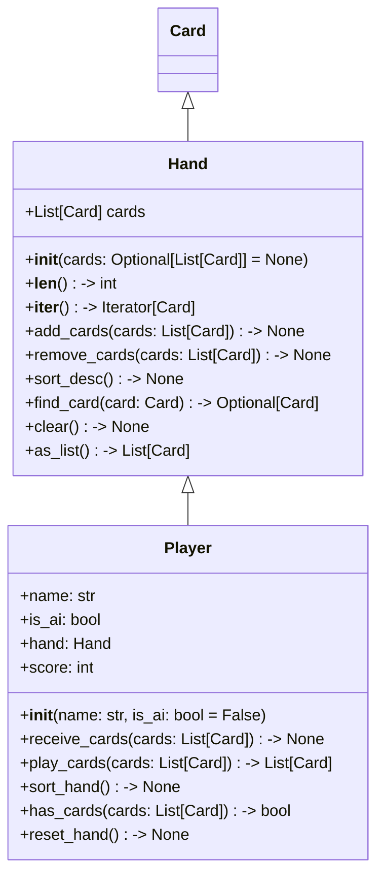

# Phase 2: Player 類別設計

## 1. 目標

建立 `Player` 與 `Hand` 的物件導向設計，負責手牌管理、手牌排序、加牌與出牌移除邏輯。
本階段專注於資料封裝與操作介面，後續階段再處理合法性與回合權限。

## 2. 檔案位置

建議：
- `game/hand.py`
- `game/player.py`
- `tests/test_p2.py`

## 3. 類別圖設計

## 4. 類別詳細

### 4.1 Hand

`Hand` 是 `Player` 的內部手牌容器，負責安全管理牌張與排序。

屬性

- `cards: list[Card]`
  - 保持當前手牌，維持可變陣列形式。

方法

- `__init__(self, cards: Optional[list[Card]] = None)`
  - 若未提供卡片，初始化為空列表。
- `__len__(self) -> int`
  - 回傳手牌張數。
- `__iter__(self) -> Iterator[Card]`
  - 支援迭代。
- `add_cards(self, cards: list[Card]) -> None`
  - 將新增卡片加入手牌，並可在必要時保持排序。
- `remove_cards(self, cards: list[Card]) -> None`
  - 移除指定卡片，若任一張不存在則拋出 `ValueError`。
- `sort_desc(self) -> None`
  - 以 Big Two 規則排序手牌：先比 `rank`，再比 `suit`，`2` 為最大。
- `find_card(self, card: Card) -> Optional[Card]`
  - 搜尋手牌中特定卡片。
- `clear(self) -> None`
  - 清空手牌。
- `as_list(self) -> list[Card]`
  - 回傳手牌副本，避免外部直接修改。

#### 4.1.1 手牌排序策略

- 依賴 `Card` 內的比較邏輯與 `to_sort_key()`。
- 建議排序順序為「由大到小」，使遊戲介面與選牌邏輯更直覺。
- 範例如 `Hand.sort_desc()`：`self.cards.sort(reverse=True)`。

### 4.2 Player

`Player` 封裝玩家資訊與手牌控制，是遊戲中每位參與者的核心物件。

屬性

- `name: str`
- `is_ai: bool`
- `hand: Hand`
- `score: int`

方法

- `__init__(self, name: str, is_ai: bool = False)`
  - 初始化玩家名稱、AI 標誌、空手牌與分數。
- `receive_cards(self, cards: list[Card]) -> None`
  - 接收牌張並加入 `hand`。
- `play_cards(self, cards: list[Card]) -> list[Card]`
  - 從手牌移除指定卡片並回傳出牌列表；若卡片不存在則拋出 `ValueError`。
- `sort_hand(self) -> None`
  - 將手牌按 Big Two 規則排序。
- `has_cards(self, cards: list[Card]) -> bool`
  - 檢查手牌是否包含指定所有卡片。
- `reset_hand(self) -> None`
  - 清空手牌，用於新一局或測試初始化。

### 4.3 設計原則

- **封裝手牌操作**：`Player` 不直接操縱裸陣列，而是透過 `Hand` 提供封裝方法。
- **明確錯誤行為**：`remove_cards()` 在移除不存在卡片時拋出例外，避免出牌階段出現隱性錯誤。
- **排序一致性**：所有手牌操作完成後，`sort_hand()` 能讓 UI 與後續比大小邏輯使用已排序手牌。
- **易於測試**：`Player` 與 `Hand` 的方法單一且可獨立測試。

## 5. 延伸建議

- 若要支援「發牌階段後立即排序」，可於 `receive_cards()` 內部自動呼叫 `sort_desc()`。
- 若需額外策略，將 `Hand` 攻能拆分為 `HandValidator` 或 `HandAnalyzer`，避免單一類別過於龐大。

## 6. 重構檢查清單

- [ ] `Hand.add_cards()` 是否保證加入後不改變原始卡片順序
- [ ] `Hand.remove_cards()` 是否於部分失敗情況下維持原狀
- [ ] `Player.play_cards()` 是否正確回傳被移除卡片
- [ ] 是否在 `Player` 內加入 `has_cards()` 判斷支援後續出牌合法性
- [ ] 是否加入完整型別註解與文檔字串