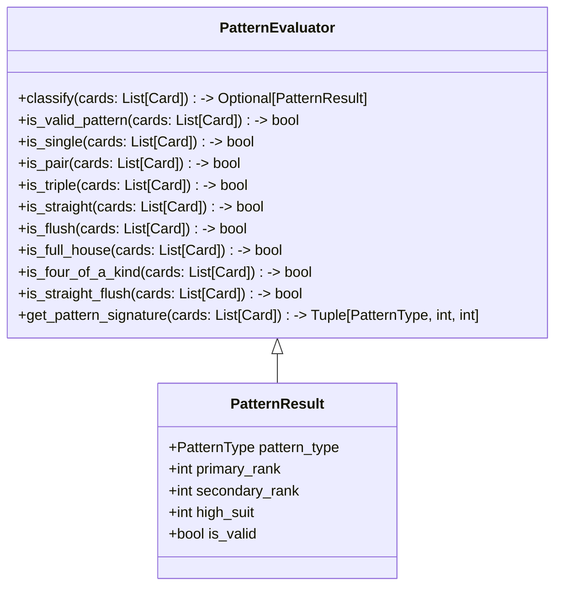

# Phase 3: PatternEvaluator 類別設計

## 1. 目標

實作 `PatternEvaluator` 類別，負責驗證與萃取大老二各種牌型特徵。
本階段聚焦於單張、對子、三條與 5 張牌型的判斷，為 RuleEngine 比較與合法性檢查提供基礎資料。

## 2. 檔案位置

建議：
- `game/patterns.py`
- `tests/test_p3.py`

## 3. 類別圖設計

## 4. PatternEvaluator 方法

### 4.1 主要功能

- `classify(cards: list[Card]) -> Optional[PatternResult]`
  - 根據牌張數與結構判斷牌型，回傳帶有主牌面與花色的 `PatternResult`。
- `is_valid_pattern(cards: list[Card]) -> bool`
  - 驗證是否為合法牌型。
- `get_pattern_signature(cards: list[Card]) -> tuple[PatternType, int, int]`
  - 回傳可用於比較的牌型簽章，例如 `(PatternType.FULL_HOUSE, 14, 0)`。

### 4.2 單張、對子、三條

- `is_single(cards)`
  - `len(cards) == 1`
- `is_pair(cards)`
  - `len(cards) == 2` 且兩張牌 `rank` 相同
- `is_triple(cards)`
  - `len(cards) == 3` 且三張牌 `rank` 相同

### 4.3 5 張牌型檢查順序

1. `is_straight_flush`
2. `is_four_of_a_kind`
3. `is_full_house`
4. `is_flush`
5. `is_straight`

### 4.4 五張牌型細節

- `is_flush(cards)`
  - 所有 `suit` 相同。
- `is_straight(cards)`
  - 5 張牌面連續，允許 Big Two 特殊順子 `A-2-3-4-5`。
- `is_full_house(cards)`
  - 三張相同 `rank` 加上兩張相同 `rank`。
- `is_four_of_a_kind(cards)`
  - 四張相同 `rank` 加上一張雜牌。
- `is_straight_flush(cards)`
  - 同時滿足 `is_straight` 與 `is_flush`。

### 4.5 牌型特徵提取

- `primary_rank`：牌型核心大小，例如對子 rank、三條 rank、順子最高 `rank`。
- `secondary_rank`：用於葫蘆與四條的輔助 rank。
- `high_suit`：當主牌 rank 相同時，取最高花色以區分牌面大小。

## 5. 設計原則

- **單一職責**：PatternEvaluator 專注於判斷與特徵萃取，不修正手牌或進行回合管理。
- **可擴充性**：未來 RuleEngine 可直接消費 `PatternResult` 進行大小比較或合法性驗證。
- **明確回傳值**：使用 `PatternResult` 或簽章 tuple 讓比較邏輯不必重複對牌型做相同判斷。
- **Big Two 特性內建**：順子判斷必須支援 `A-2-3-4-5`；單張/對子/三條比較則依 `Card` 的 rank 與 suit。

## 6. 測試建議檔案

- `tests/test_p3.py`

## 7. 重構檢查清單

- [ ] 將 `is_straight` 與 `is_flush` 分離為獨立方法
- [ ] `classify` 僅在單一入口進行牌型判斷
- [ ] `get_pattern_signature` 可被 RuleEngine 重用
- [ ] 避免在判斷時修改傳入參數列表
