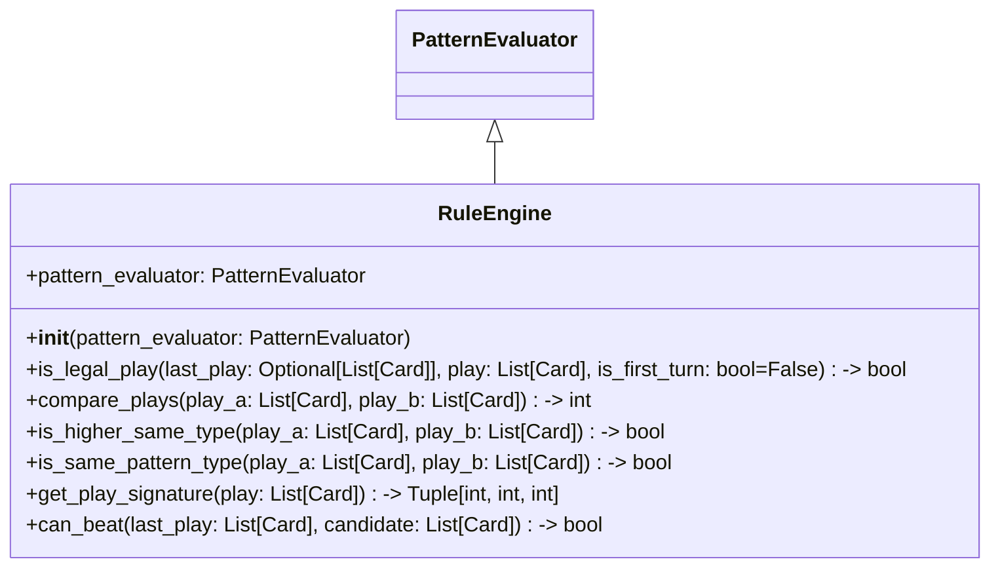

# Phase 4: RuleEngine 類別設計

## 1. 目標

建立 `RuleEngine`，負責確認出牌合法性、牌型等級比較與回合可出牌範圍。
本階段重點在 `PatternEvaluator` 結果的應用，讓不同牌型間比較與接續上家出牌的判斷一致。

## 2. 檔案位置

建議：
- `game/rules.py`
- `tests/test_p4.py`

## 3. 類別圖設計

## 4. RuleEngine 方法

### 4.1 主要功能

- `is_legal_play(last_play, play, is_first_turn=False)`
  - 確認當前出牌是否合法。
  - 第一回合必須出 `3♣`。
  - 若 `last_play` 為 `None`，只需確認 `play` 為合法牌型。
  - 否則需比較 `play` 是否為相同牌型且更大。
- `compare_plays(play_a, play_b)`
  - 比較兩組牌的大小。
  - 先比較牌型等級，再比較主牌 rank，最後比較主花色。
  - 回傳 `1` 表示 `play_a` 較大，`-1` 表示 `play_b` 較大，`0` 表示相等。
- `can_beat(last_play, candidate)`
  - 在同牌型條件下確認 `candidate` 是否能贏過 `last_play`。
- `is_same_pattern_type(play_a, play_b)`
  - 檢查兩手牌是否屬於相同的 `PatternType`。
- `get_play_signature(play)`
  - 產生可比較的簽章，例如 `(pattern_rank, primary_rank, high_suit)`。

### 4.2 合法性條件

- `play` 必須為合法 `PatternEvaluator` 可分類的牌型。
- `last_play` 與 `play` 必須具有相同牌張數。
- `play` 與 `last_play` 必須為相同牌型。
- `play` 的牌型簽章必須大於 `last_play`。

### 4.3 比較邏輯

- 牌型等級從低到高：
  - `SINGLE`, `PAIR`, `TRIPLE`, `STRAIGHT`, `FLUSH`, `FULL_HOUSE`, `FOUR_OF_A_KIND`, `STRAIGHT_FLUSH`
- 若牌型相同，依照 `primary_rank` 比較。
- 若 `primary_rank` 相同，則比較 `high_suit`（同牌型、同主牌 rank 時決定勝負）。
- 對於 `FULL_HOUSE` 與 `FOUR_OF_A_KIND`，`secondary_rank` 可用於精準描述不同形態，若需要可納入簽章。

## 5. 設計原則

- **分層責任**：`PatternEvaluator` 只負責判斷牌型，`RuleEngine` 則負責比較與合法性規則。
- **可測試性**：所有 `compare_plays()` 與 `is_legal_play()` 情境需可獨立測試。
- **一致性**：`RuleEngine` 的判斷應與 `PatternEvaluator` 回傳的 `PatternResult` 直接對應，不得重複定義牌型比較規則。
- **明確回傳**：`compare_plays()` 回傳整數以支持呼叫方簡單判斷贏、輸、和。

## 6. 重構檢查清單

- [ ] `is_legal_play()` 是否兼容 `last_play=None` 與第一回合條件。
- [ ] 是否避免在比較時重新判斷牌型，而是重用 `PatternResult`。
- [ ] 是否正確處理 `SAME_PATTERN_TYPE` 與牌張數不同的情況。
- [ ] 是否支援 `STRAIGHT_FLUSH` 與其他 5 張複合牌型的比較。 