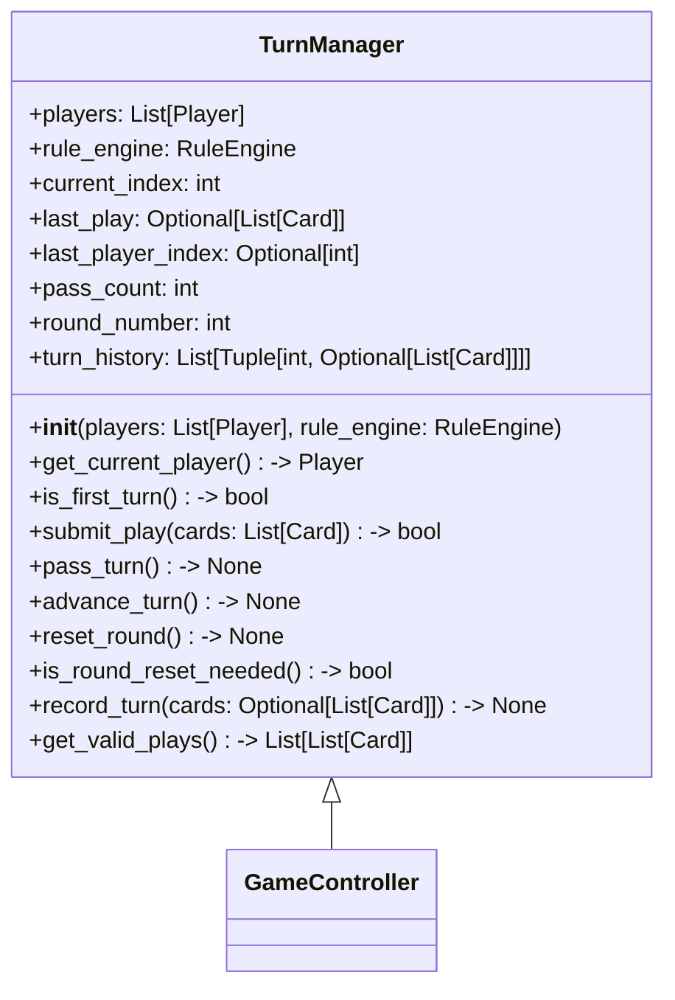

# Phase 5: TurnManager 類別設計

## 1. 目標

實作 `TurnManager`，負責維護桌面回合狀態、過牌邏輯、輪替順序與回合重置。
此模組不處理牌型比較或牌型分類，而專注於「誰該出牌」、「是否可以過牌」及「何時清空桌面」的流程。

## 2. 檔案位置

建議：
- `game/turn_manager.py`
- `tests/test_p5.py`

## 3. 類別圖設計

## 4. TurnManager 方法

### 4.1 初始化與屬性

- `players: list[Player]`
  - 玩家清單，包含人類與 AI。
- `rule_engine: RuleEngine`
  - 用於合法性判斷與同牌型比較。
- `current_index: int`
  - 目前輪到的玩家索引。
- `last_play: Optional[list[Card]]`
  - 桌面上最後一手有效出牌。
- `last_player_index: Optional[int]`
  - 最後出牌玩家索引，用於判定回合重置。
- `pass_count: int`
  - 連續過牌次數；達到 `len(players) - 1` 時清空桌面。
- `round_number: int`
  - 已經進行多少回合，可用於計分或顯示。
- `turn_history: list[tuple[int, Optional[list[Card]]]]`
  - 紀錄每回合玩家行為。

### 4.2 核心行為

- `get_current_player(self) -> Player`
  - 回傳目前輪到的玩家。
- `is_first_turn(self) -> bool`
  - 當 `last_play is None` 且 `pass_count == 0`，表示新回合開始。
- `submit_play(self, cards: list[Card]) -> bool`
  - 使用 `RuleEngine.is_legal_play()` 驗證出牌。
  - 合法則重設 `pass_count`、更新 `last_play`、`last_player_index`，並記錄回合。
  - 非法則保留狀態並回傳 `False`。
- `pass_turn(self) -> None`
  - 將 `pass_count` 加一，記錄過牌，若連續過牌達到 `len(players) - 1`，呼叫 `reset_round()`。
- `advance_turn(self) -> None`
  - 將 `current_index` 移至下一位玩家，跳過已出局玩家（若適用）。
- `reset_round(self) -> None`
  - 清空 `last_play`、`last_player_index`，`pass_count = 0`，並將當前玩家設為 `last_player_index` 的下一位。
- `is_round_reset_needed(self) -> bool`
  - 當 `pass_count >= len(players) - 1` 且 `last_play is not None`。
- `record_turn(self, cards: Optional[list[Card]]) -> None`
  - 保存玩家本回合的行為以供日誌或 debug。

### 4.3 遊戲流程中的 TurnManager

- 每次玩家出牌：
  1. 呼叫 `submit_play(cards)`。
  2. 若合法，更新桌面狀態與回合歷史。
  3. 呼叫 `advance_turn()`。
- 每次玩家過牌：
  1. 呼叫 `pass_turn()`。
  2. 若需重置回合，則 `reset_round()`。
  3. 呼叫 `advance_turn()`。

### 4.4 回合權限移轉

- `current_index` 決定輪到誰。當玩家合法出牌後，下一位玩家接續。
- 若玩家過牌但尚未觸發回合重置，仍移動到下一位玩家。
- 重置回合後，上一個有效出牌者不再受 `last_play` 限制，其下一輪可自由出牌。

## 5. 設計原則

- **分離控制與判斷**：`TurnManager` 不做牌型判斷，只依 `RuleEngine` 決定合法性。
- **明確狀態轉移**：出牌、過牌、重置回合皆為獨立可測方法。
- **支援可測記錄**：`turn_history` 讓回合流程可重放與除錯。
- **易於整合**：`GameController` 只需從 `TurnManager` 取得當前玩家、輪替與桌面狀態。

## 6. 測試建議檔案

- `tests/test_p5.py`

## 7. 重構檢查清單

- [ ] 確保 `reset_round()` 不改變玩家順序只清空桌面
- [ ] 檢查 `pass_turn()` 在最後一位玩家時仍能正確迴圈
- [ ] `submit_play()` 失敗時不應修改 `pass_count` 或 `last_play`
- [ ] `record_turn()` 是否提供完整回合紀錄