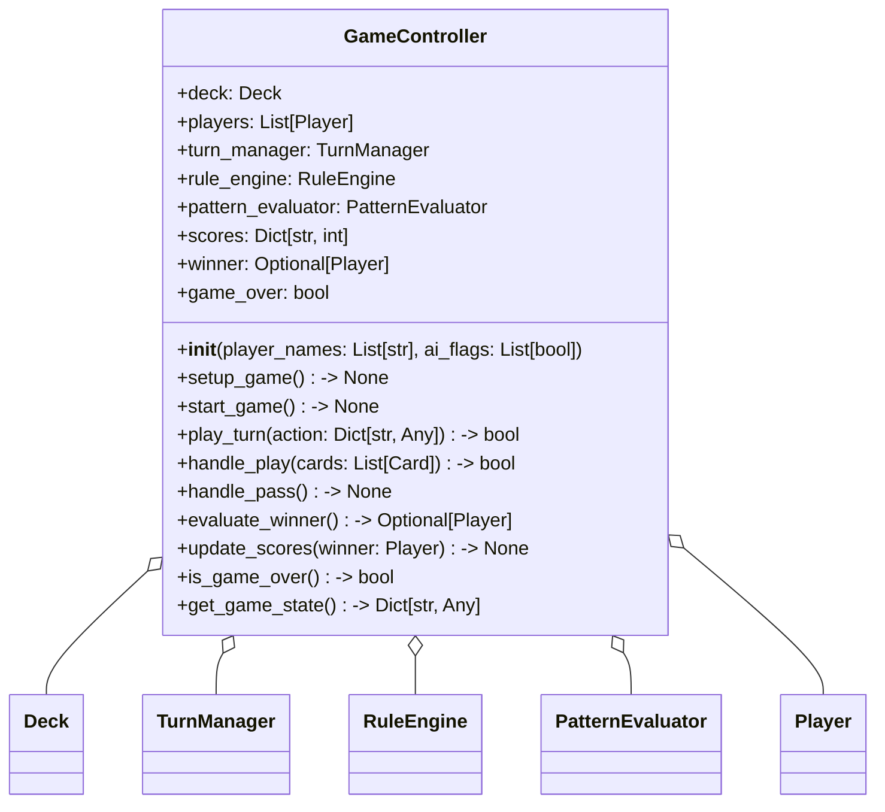

# Phase 6: GameController 類別設計

## 1. 目標

實作 `GameController`，負責遊戲主迴圈、勝負判定、分數管理與互動流程。
此模組整合 `Deck`, `Player`, `PatternEvaluator`, `RuleEngine` 與 `TurnManager`，並提供可被 CLI 或 UI 呼叫的遊戲入口。

## 2. 檔案位置

建議：
- `game/controller.py`
- `tests/test_p6.py`

## 3. 類別圖設計

## 4. GameController 方法

### 4.1 初始化與狀態

- `deck: Deck`
  - 負責發牌與重置牌堆。
- `players: list[Player]`
  - 玩家清單。
- `turn_manager: TurnManager`
  - 管理回合與出牌流程。
- `rule_engine: RuleEngine`
  - 判斷出牌合法性。
- `pattern_evaluator: PatternEvaluator`
  - 判斷牌型並提供比較資訊。
- `scores: dict[str, int]`
  - 玩家得分紀錄。
- `winner: Optional[Player]`
  - 當局勝者。
- `game_over: bool`
  - 遊戲是否結束。

### 4.2 核心行為

- `setup_game(self) -> None`
  - 建立 `Deck`、發牌、初始化 `TurnManager`、設定起手玩家。
- `start_game(self) -> None`
  - 進入遊戲流程，直到 `game_over`。
- `play_turn(self, action: dict) -> bool`
  - 接收玩家操作，可能包含 `{'type': 'play', 'cards': [...]}` 或 `{'type': 'pass'}`。
- `handle_play(self, cards: list[Card]) -> bool`
  - 呼叫 `TurnManager.submit_play()`，若合法則從玩家手牌移除、更新狀態，並判斷是否有人出完牌。
- `handle_pass(self) -> None`
  - 呼叫 `TurnManager.pass_turn()`。
- `evaluate_winner(self) -> Optional[Player]`
  - 檢查玩家手牌是否為空，若是則設定 `winner` 並結束遊戲。
- `update_scores(self, winner: Player) -> None`
  - 更新分數，支援單局計分或多局累計。
- `get_game_state(self) -> dict`
  - 回傳目前遊戲狀態，供 UI 或 CLI 顯示。

### 4.3 遊戲主流程

1. `setup_game()`：初始化牌堆與玩家手牌。
2. `while not is_game_over()`：
   - 取得 `turn_manager.get_current_player()`。
   - 若為 AI，執行 AI 決策（可由 AI 模組提供）。
   - 若為人類，等待外部介面傳入操作。
   - 呼叫 `play_turn(action)`。
   - 檢查 `evaluate_winner()`。
3. 結束時回傳勝者與最終分數。

### 4.4 獲勝與記分規則

- 當任一玩家手牌數為 `0` 時，遊戲結束。
- `evaluate_winner()` 應優先判斷目前最新出牌者是否清空手牌。
- `update_scores()` 可設計為：勝者 +100，其他玩家依剩餘手牌扣分。

## 5. 設計原則

- **整合各模組**：`GameController` 不做具體牌型判斷，僅調用 `RuleEngine`、`TurnManager` 與 `PatternEvaluator`。
- **單一入口**：玩家輸入皆經由 `play_turn()` 處理。
- **可擴展 UI/CLI**：透過 `get_game_state()` 與 `play_turn()` 分離顯示與控制。
- **可測試性**：遊戲流程應可透過模擬 `action` 物件進行測試，不需依賴實際 UI。

## 6. 測試建議檔案

- `tests/test_p6.py`

## 7. 重構檢查清單

- [ ] `setup_game()` 是否能重覆初始化多局
- [ ] `play_turn()` 是否處理所有 `action` 類型
- [ ] `evaluate_winner()` 是否在玩家出完時立即結束遊戲
- [ ] `get_game_state()` 是否包含 `current_player`, `last_play`, `scores`